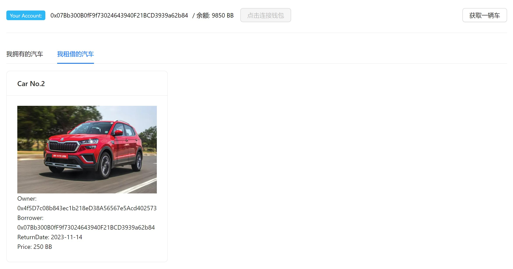

# ZJU-blockchain-course-2023

⬆ 可以️修改成你自己的项目名。

> 第二次作业要求（以下内容提交时可以删除）：
> 
> 简易汽车借用系统，参与方包括：汽车拥有者，有借用汽车需求的用户
>
> 背景：ERC-4907 基于 ERC-721 做了简单的优化和补充，允许用户对NFT进行租借。
> - 创建一个合约，在合约中发行NFT集合，每个NFT代表一辆汽车。给部分用户测试领取部分汽车NFT，用于后面的测试。
> - 在网站中，默认每个用户的汽车都可以被借用。每个用户可以： 
>    1. 查看自己拥有的汽车列表。查看当前还没有被借用的汽车列表。
>    2. 查询一辆汽车的主人，以及该汽车当前的借用者（如果有）。
>    3. 选择并借用某辆还没有被借用的汽车一定时间。
>    4. 上述过程中借用不需要进行付费。
> 
> - （Bonus）使用自己发行的积分（ERC20）完成付费租赁汽车的流程
> - 请大家专注于功能实现，网站UI美观程度不纳入评分标准，但要让用户能够舒适操作。简便起见，可以在网上找图片代表不同汽车，不需要将图片在链上进行存储。

**以下内容为作业仓库的README.md中需要描述的内容。请根据自己的需要进行修改并提交。**

作业提交方式为：**提交视频文件**和**仓库的链接**到指定邮箱。

## 如何运行

补充如何完整运行你的应用。

1. 在本地启动ganache应用。

2. 在 `./contracts` 中安装需要的依赖，运行如下的命令：
    ```bash
    npm install
    ```
3. 在 `./contracts` 中编译合约，运行如下的命令：
    ```bash
    npx hardhat compile
    ```
4. 将编译后的合约文件分别（在`./contracts/artifacts/contracts`中的 json 文件）复制到`.frontend/src/util/abis`中对应的 json 文件中
5. 在`./contracts/hardhat.config.ts`中将ganache的url和账户私钥设置为自己的，然后部署合约：
   ```bash
   npx hardhat run ./scripts/deploy.ts --network ganache
   ```
   并将合约部署的地址复制到`.frontend/src/util/contract-address.json`中，并根据4、5两个步骤编写完成同一目录下`contracts.ts`的内容。
6. 在 `./frontend` 中安装需要的依赖，运行如下的命令：
    (因为本项目的前端使用了`yarn`包管理器，所以下面提供了`yarn`的相关指令)
    ```bash
    yarn install
    ```
7. 在 `./frontend` 中启动前端程序，运行如下的命令：
    ```bash
    yarn run dev
    ```

## 功能实现分析

#### 连接MetaMask账户

因为后续汽车租借功能都需要基于账户实现，所以本应用在入口组件（`App`）渲染时会先连接到 ganache 网络上的 MetaMask 账户。连接账户的代码在助教提供的 demo 中已经基本齐全，步骤如下：

首先初始化检查用户是否已经连接钱包：查看window对象里是否存在ethereum（metamask安装后注入的）对象，如果存在，则获取当前连接的用户账户（即 MetaMask 插件中当前连接的账户），否则提示用户尚未绑定钱包，并 enable `点击连接钱包`这个按钮。

`点击连接钱包`按钮点击后可以连接上当前的 MetaMask 连接的账户，实现逻辑如下：
和上面一样，首先初始化检查用户是否已经连接钱包，如果当前小狐狸不在本地链上，则切换Metamask到本地测试链，即切换到本地网络（如果本地网络没有添加到Metamask中，添加该网络），小狐狸成功切换网络后，接下来让小狐狸请求用户的授权，并连接上当前的账户。

#### 获取当前账户的代币余额

本应用中的付费汽车租借功能是基于自己发行的代币`MyERC20`（单位`BB`）实现的，因此为方便考虑，在界面上需要展示用户的代币余额。

代币余额的获取在连接 MetaMask 账户之后，如果上一步中获取到了一个合法的账户（若上一步没成功则不会进行这一步），则调用`MyERC20`合约中的`getBalance`方法，获取当前的账户余额，并使用 react 中对应的 `setState` 钩子函数将其渲染在页面上。

#### 分发汽车NFT

为了实现账户间汽车的互相租借，需要给账户分发一些汽车NFT。为了简化实际应用中用户上传自己的汽车信息这一过程，本应用中采用了点击页面上的`获取一辆车`按钮即可直接获取一个汽车NFT（正式名称为`CarNFT`，符号为`CAR`）的处理方式。

用户点击该按钮后，前端将会调用`BorrowYourCar`合约中的`mintCarNFT`方法，为该用户分发一辆新的汽车。在方法内部，这是通过调用`ERC721`合约的`_mint`函数实现的。

这将创建一个新的汽车NFT（在合约中用`Car`结构体表示），并且该NFT的`owner`为当前账户，`borrower`和`returnDate`均暂空。为方便起见，汽车的租金`price`是由一个常量数组取余分配的。每个汽车NFT都有一个唯一的`tokenId`，即是其在NFT列表中的索引。

#### 汽车列表分类展示

根据作业要求，本应用要实现的功能中包括了：
> - 查看自己拥有的汽车列表。查看当前还没有被借用的汽车列表。
> - 查询一辆汽车的主人，以及该汽车当前的借用者（如果有）。

这两个功能可以通过对汽车列表的分类展示设计来实现:
本应用通过导航栏和路由划分了两个页面，分别是**首页**和**个人中心**，分别通过`Tabs`组件切换展示不同的汽车列表：
- 首页：所有汽车、可租借汽车
- 个人中心：我拥有的汽车、我租借的汽车

这些汽车列表分别通过调用`BorrowYourCar`合约中的`getAllCars`、`getCarsCanBorrow`、`getMyCars`、`getMyborrowedCars`方法获取。用户点击`Tabs`组件中的不同标签时就可以调用`carsList`的`setState`钩子函数，切换要查看的汽车列表。列表中的汽车通过**卡片**（自定义的`<CarCard/>`组件）的形式展示，在页面中按3个一行的网格形式分布，每张卡片中都显示了该汽车（NFT）的图片（静态数据）、owner、borrower、returnDate 和 price 信息。

如果某辆汽车是可以被当前用户租借的（未被租借且拥有者不是当前账户），则在汽车卡片的右上角会显示蓝色的`租借`按钮。

#### 付费汽车租借

点击汽车卡片上的`租借`按钮，即可进入租借该汽车的流程：前端会先弹出一个对话框，要求选择还车日期，用户通过日期选择器选择日期后，点击`OK`按钮，在跳出的 MetaMask 窗口上确认进行交易，即完成租借，页面内容也随之进行更新（用户余额、当前汽车状态）。

该租借过程是通过调用`BorrowYourCar`合约中的`borrowACar`方法实现的，该方法首先会检查当前账户的余额是否充足，如果充足，则更改该车辆的信息，并且调用`MyERC20`合约中的`transfer`方法，将等于租金量的代币转移到该车的拥有者账户上。


## 项目运行截图

#### 用户界面展示

打开该应用后界面如下：

可见左侧为导航栏，可以切换浏览的页面，右侧则显示用户信息和当前查看的汽车列表。
因为进行过几次应用调试，所以汽车列表中已经有了一些数据。

#### 获取账户及余额信息

账户信息显示在右侧页面最上，设定为在每次页面渲染时可以自动获取到当前 MetaMask 上连接的账户。如没有连接账户，则在连接后也可以通过`点击连接钱包`按钮手动连接账户。
可以看到当前页面上获取到的账户和 MetaMask 上连接的账户是一致的：

(此时已经获取到了账户信息，所以右侧手动连接按钮被 disable 掉了；因为本应用中发行的代币是独立于 ETH 的货币，账户中的 ETH 消耗仅来自合约部署与执行，与余额 BB 无关)

#### 汽车列表分类展示

使用路由和`<Tabs/>`组件切换显示不同的汽车列表（注意观察截图中汽车卡片上的`owner`和`borrower`信息）。
1. 所有汽车：
   展示本应用内所有汽车
   

2. 可租借的汽车：
   展示当前账户可租借的汽车（owner非当前账户且没有被借用的，这样的汽车卡片右上角会显示`租借`按钮）
   

3. 我拥有的汽车：
   展示所有 owner 为当前账户的汽车
   
   
4. 我租借的汽车：
   展示所有 borrower 为当前账户的汽车
   （当前账户还未借用汽车，所以列表为空）
   


#### 分发汽车NFT

点击账户信息栏最右的`获取一辆车`按钮，即可获取一辆汽车（一个汽车NFT）

点击后就会跳出 MetaMask 的确认交易信息：
<center>


</center>
点击确认，可以看到列表中新增了一张 owner 为当前账户的汽车卡片：


#### 付费汽车租借

点击可租借的汽车卡片右上角的`租借`按钮，页面上会先跳出一个选择还车日期的弹窗：

选择好还车日期后点击`OK`按钮，跳出 MetaMask 的确认交易信息：
<center>


</center>
完成后会有弹窗提示借车成功：
<br>

汽车列表和交易双方账户余额也随之发生变化（进行了租金的转账）：

（这里第二个账户的初始余额忘记截图了，为 9900 BB，抱歉抱歉）


## 参考内容

- 课程的参考Demo见：[DEMOs](https://github.com/LBruyne/blockchain-course-demos)。

- ERC-4907 [参考实现](https://eips.ethereum.org/EIPS/eip-4907)

